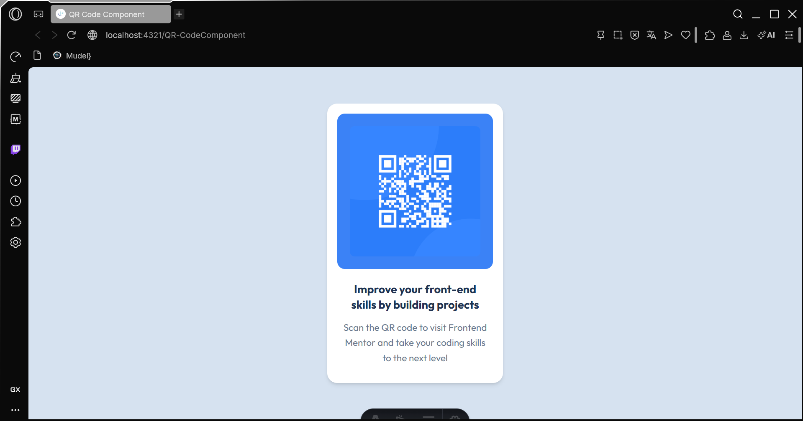

# 🧩 Proyecto: Componente QR Code

Este proyecto consiste en el desarrollo de un **componente de Código QR** utilizando **Astro** y **Tailwind CSS**.  
El objetivo es aplicar los conocimientos sobre **componentes**, **maquetación**, **estilos responsivos** y **utilidades CSS** para construir un diseño limpio, moderno y adaptable a diferentes dispositivos.

---

## 📖 Descripción general
En esta actividad se desarrolló un componente de Código QR utilizando Astro y Tailwind CSS, con el objetivo de poner en práctica los conocimientos en la creación de componentes, uso de estilos y diseño responsivo.

El reto consiste en recrear el componente del Código QR lo más parecido posible al diseño proporcionado. 

### 🧩 Vista previa del proyecto

---

### 🔗 Enlaces del proyecto

- **Repositorio en GitHub:** [https://github.com/arturocruz-0503/QR-Code-Component](https://github.com/)

---

## 🧠 Proceso de desarrollo
Me basé en la imagen demostrativa proporcionada por la docente y fui cambiando propiedades de los componentes que fui creando para que se viera lo más parecido posible, aunque terminé usando menos componentes de los que pensaba inicialmente.

### 🛠️ Tecnologías utilizadas
Lista las herramientas y tecnologías que utilizaste en el proyecto. Por ejemplo:

- [Astro](https://astro.build)
- [Tailwind CSS](https://tailwindcss.com/)
- HTML5 semántico
- Diseño responsivo (Mobile-first)
- Componentes reutilizables

---

### 💡 Lo que aprendí

Aprendí que el uso de Tailwind siempre puede ser mucho mayor al que utilizamos.

### 🚀 Áreas de mejora

El utilizar de mejor manera tanto Astro y Tailwind, ambos tienen muchas herramientas a nuestra disposición que pueden ser útlies para hacernos más fácil el trabajo a la hora de hacer una página web. 

### 📚 Recursos útiles

**Ejemplo:**
- [Documentación de Astro](https://docs.astro.build)  
- [Guía oficial de Tailwind CSS](https://tailwindcss.com/docs)  
- [MDN Web Docs - HTML y CSS](https://developer.mozilla.org/es/)  
- [Guía de diseño responsivo](https://web.dev/responsive-web-design-basics/)  

---

### 👩‍💻 Autor

- **Nombre completo: Luis Arturo Cruz Coria**  
- **Carrera:ITICS**  
- **Grupo: 11 am a 12 am**  
- **Correo institucional:23151197@aguascalientes.tecnm.mx**  

---

### ✨ Reflexión final

- ¿Qué fue lo más fácil o lo más difícil de realizar?  Implementar los diferentes componentes que se crean con Astro
- Explorar las funciones que se pueden utilizar tanto en Astro y Tailwind 
- ¿Cómo aplicarías lo aprendido en proyectos futuros? A la hora de darle diseño front-end a los proyectos para que queden visualmente atractivos
